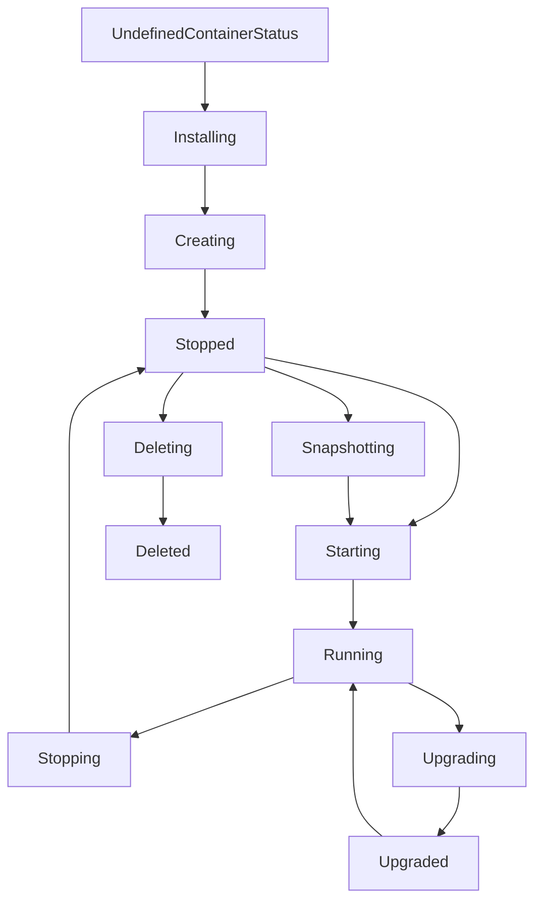

# gRCP API protobuf definitions

## API v1

### HostsService

#### InfoUpdate

Update host info. Possible fields are defined in [host.proto](https://github.com/blockjoy/api-proto/blob/63e00e0fdc527b737da2b4b8e3d051dc89e0d148/blockjoy/api/v1/host.proto#L14-L22)
Fields set to None are _NOT_ updated resulting in not being able to set a field to null.

#### Provision

see [OpenAPI doc](https://stakejoy.stoplight.io/docs/blockvisor-api/6119082e85f3b-claim-a-host-provision)
Calling HostsService.Provision results in claiming the host provision earlier created during BV setup.

The one-time-password (OTP) required in [ProvisionHostRequest](https://github.com/blockjoy/api-proto/blob/63e00e0fdc527b737da2b4b8e3d051dc89e0d148/blockjoy/api/v1/host.proto#L26)
is assigned to the user who provisioned (registered) the host by showing it on the command-line.

### Command flow service

#### Commands

This represents a bidirectional stream, where the stakejoy-api sends commands and retrieves status updates sent by BV
asynchronously. Commands are defined to be at a single node level, so each command will be executed by BV (via babel)
against a single node on given host.

Possible commands are (defined in [node.proto](https://github.com/blockjoy/api-proto/blob/main/blockjoy/api/v1/node.proto)):

- **NodeStart:** Start node VM
- **NodeStop:** Stop node VM
- **NodeRestart:** Restart node VM
- **NodeUpgrade:** Upgrade node VM
- **NodeInfoUpdate:** Force node status update
- **NodeInfoGet:** Force retrieving current node status
- **NodeCreate:** Create a node
- **NodeDelete:** Delete a node
- **NodeGenericCommand:** Generic command used for building yet unknown commands (use with caution! Try to create a dedicated command instead if applicable)
- **HostGenericCommand:** Generic host command (same here: use with caution!)
- **HostUpdateBVS:** Update BVS
- **HostRestartBVS:** Restart BVS
- **HostRemoveBVS:** Remove BVS from host

All commands are wrapped inside a [NodeCommand](https://github.com/blockjoy/api-proto/blob/63e00e0fdc527b737da2b4b8e3d051dc89e0d148/blockjoy/api/v1/node.proto#L75) message, containing the node ID and corresponding metadata.

**Info updates**

Info updates will be sent from BV to API. Possible updates:

- HostInfo
- NodeInfo
- CommandInfo

#### Container states flow

