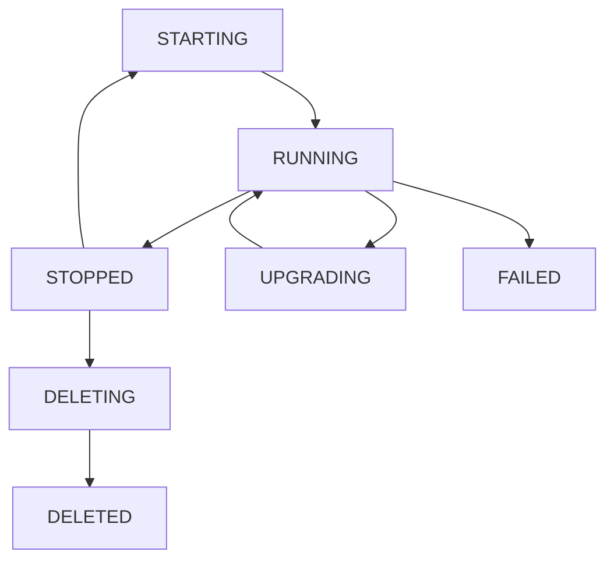

# BlockVisor API Protobuf Definitions

Protobuf / gRPC API definitions for `blockvisor-api`, the control plane of the BlockVisor stack. This repository contains **only `.proto` files** — no generated code is committed. Each consumer (the Rust API server, the TypeScript frontend, BlockVisor host agents) generates its own bindings from these definitions.

## Layout

Two packages, mirrored by directory:

| Path | Package | Contents |
| --- | --- | --- |
| `blockjoy/v1/` | `blockjoy.v1` | One file per gRPC service, plus that service's request/response messages. |
| `blockjoy/common/v1/` | `blockjoy.common.v1` | Shared, service-agnostic types with **no services** (e.g. `Resource`, node/VM/image config, firewall rules, currency, search/tag helpers). |

The `blockjoy.v1` services import shared types from `blockjoy.common.v1`. Import cycles between packages are forbidden (enforced by the `PACKAGE_NO_IMPORT_CYCLE` lint rule).

## Services (`blockjoy/v1/`)

| File | Service | Purpose |
| --- | --- | --- |
| `api_key.proto` | `ApiKeyService` | Create, list, and delete API keys. |
| `archive.proto` | `ArchiveService` | Presigned download/upload of archived protocol data, including multi-client (`ByStoreKey`) flows and direct S3 config. |
| `auth.proto` | `AuthService` | Login, token refresh, registration confirmation, password reset/update, permission listing. |
| `bundle.proto` | `BundleService` | Retrieve bundle URLs and list bundle versions. |
| `command.proto` | `CommandService` | Deliver host/node commands and collect acknowledgements and status updates. |
| `crypt.proto` | `CryptService` | Get/put resource-scoped encrypted secrets. |
| `discovery.proto` | `DiscoveryService` | Service discovery (e.g. notification/MQTT URL). |
| `event.proto` | *(none)* | Event payload messages only (node/host/org/invitation events). |
| `host.proto` | `HostService` | CRUD for hosts and regions; start/stop/restart hosts. |
| `image.proto` | `ImageService` | Manage protocol image builds, archives, and image properties. |
| `invitation.proto` | `InvitationService` | Create/list/accept/decline/revoke org invitations; admin bulk invite. |
| `metrics.proto` | `MetricsService` | Submit host and node metrics. |
| `node.proto` | `NodeService` | Node lifecycle (create/get/list/start/stop/restart/delete), config updates, image upgrades, status/error reporting. |
| `org.proto` | `OrgService` | Org CRUD, membership, provision tokens, billing/payment/address. |
| `protocol.proto` | `ProtocolService` | Manage deployable protocols, versions, variants, pricing, and stats. |
| `user.proto` | `UserService` | User CRUD and user settings. |

## Command & node lifecycle

`CommandService` delivers `Command` messages, each wrapping either a `NodeCommand` or a `HostCommand` (`command.proto`).

- **Node commands:** `NodeCreate`, `NodeStart`, `NodeStop`, `NodeRestart`, `NodeUpdate`, `NodeUpgrade`, `NodeDelete`.
- **Host commands:** `HostStart`, `HostStop`, `HostRestart`, `HostPending`.

A command can report a `CommandExitCode` (e.g. `OK`, `INTERNAL_ERROR`, `NODE_NOT_FOUND`, `BLOCKING_JOB_RUNNING`, `SERVICE_NOT_READY`, `SERVICE_BROKEN`, `NOT_SUPPORTED`, `NODE_UPGRADE_ROLLBACK`, `NODE_UPGRADE_FAILURE`).

Node state is reported via `NodeStatus` (`blockjoy/common/v1/node.proto`). `NodeState`:


```mermaid
graph TD;
    STARTING --> RUNNING;
    RUNNING --> STOPPED;
    STOPPED --> STARTING;
    RUNNING --> UPGRADING --> RUNNING;
    RUNNING --> FAILED;
    STOPPED --> DELETING --> DELETED;
```

`NextState` (`STOPPING`, `DELETING`, `UPGRADING`) signals the transition a node has been asked to make. Health is tracked separately via `NodeHealth` (`HEALTHY` / `NEUTRAL` / `UNHEALTHY`).

## Conventions

- **Service naming:** each service is `XService`; RPCs are verbs (`Get`, `List`, `Create`, `Update`, `Delete`, …).
- **Message naming:** request/response messages are `XServiceMethodRequest` / `XServiceMethodResponse` (e.g. `ArchiveServiceGetDownloadMetadataRequest`). Match this long form for new RPCs.
- **Comments required:** every service and RPC needs a leading doc comment (enforced by `COMMENT_SERVICE` / `COMMENT_RPC`).
- **Enums:** follow the `STANDARD` convention — prefixed values with a `_UNSPECIFIED = 0` zero value (e.g. `NODE_STATE_UNSPECIFIED`).
- **Optional fields:** a field that may be absent is `optional`. For update RPCs, an unset field generally means "do not update" — clients cannot null out a field by omitting it.

## Tooling & checks

Tooling is provided via a Nix flake + [direnv](https://direnv.net) (`.envrc` is `use flake`). Entering the directory loads a dev shell with [`buf`](https://buf.build) on `PATH`. Without Nix, install `buf` manually.

```bash
buf lint                                     # lint (STANDARD, COMMENT_RPC, COMMENT_SERVICE, PACKAGE_NO_IMPORT_CYCLE)
buf format -w                                # auto-format in place
buf format --diff --exit-code                # check formatting (CI fails on any diff)
buf breaking --against '.git#branch=main'    # detect breaking changes vs main
```

CI (`.github/workflows/test.yml`) runs lint, the format check, and breaking-change detection against `main` on every push and PR. **All three must pass.** Because breaking-change detection is enforced, add new fields with new field numbers rather than renaming, removing, or renumbering existing ones.

When adding an RPC: add it to the `service` block with a doc comment, define the matching `Request`/`Response` messages in the same file, then run `buf format -w` and `buf lint`.

## Generating TypeScript bindings

Bindings are generated with [`ts-proto`](https://github.com/stephenh/ts-proto) (dependencies declared in `package.json`). Initial setup:

```bash
npm install
mkdir generated
```

Then regenerate after changing protos:

```bash
./node_modules/.bin/grpc_tools_node_protoc \
    --plugin=protoc-gen-ts_proto=./node_modules/.bin/protoc-gen-ts_proto \
    --ts_proto_out=./generated \
    --ts_proto_opt=env=browser,outputServices=nice-grpc,outputServices=generic-definitions,outputJsonMethods=false,useExactTypes=false,esModuleInterop=true \
    --proto_path=./ \
    ./blockjoy/v1/*
```

The `generated/` directory is git-ignored.
